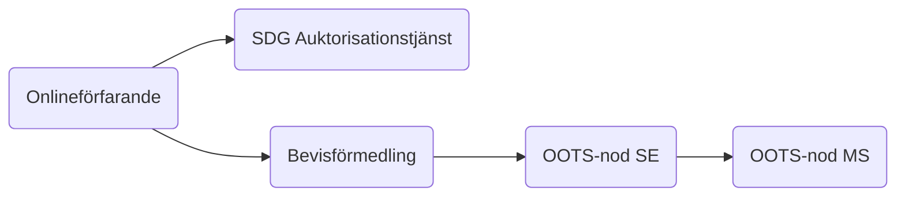
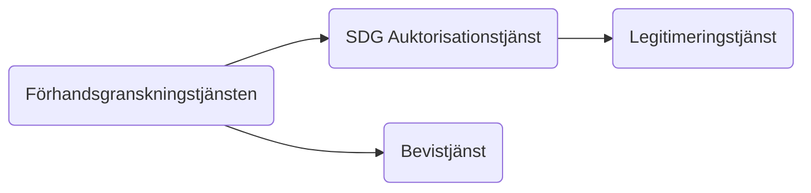
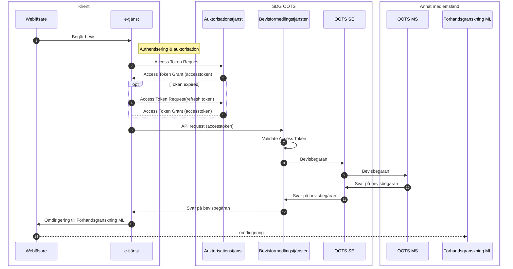
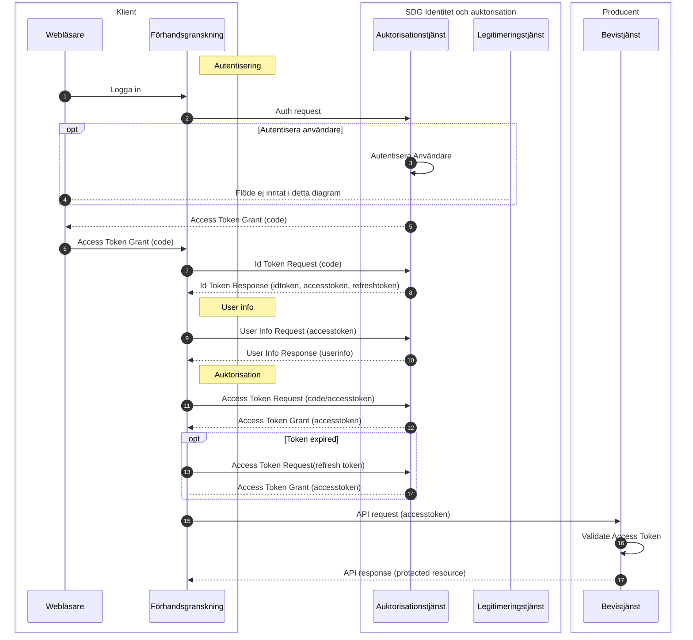

# Auktorisationsflöden - Once Only Technical System, SDG

## Auktorisationsflöden
* Bevishämtning, svenskt onlinfeförarande hämtar bevis frän annat medlemsland

* Bevisförmedling, utländskt onlinteförfarande hämtar bevis fråån Sverige

### Auktorisationsflöde vid bevishämtning
#### Beskrivning

När en användare i ett svenskt onlineförfarande vill hämta ett digitalt bevis från ett annat medlemsland.
Ett svenskt onlineförfarand begär ett åtkomstintyg för att kunna anropa den svenska bevisförmedlingstjänsten för 
att hämta ett bevis via OOTS.

#### Flödesbeskrivning

* Använderaren vill hämta ett bevis från annat medlemsland
* E-tjänsten skickar en signerad begäran om åtkomst till SDG Auktorisationstjänst
* Auktorisationstjänsten validerar begäran och kontrollerar att e-tjänsten tillhör en behörig myndighet
* Auktorisationstjänsten ställer ut ett åtkomstintyg till e-tjänsten
* E-tjänsten anropar Bevisförmedlingstjänsten och bifogar åtkomstintyget
* Bevisförmedlingstjänsten validerar att åtkomstintyget är signerat av betrodd auktorisationstjänst
* Bevisförmedlingstjänsten gör en bevisbegäran via OOTS SE

#### Detaljerat flöde

*Diagram 1: Sekvensdiagram över auktorisationsflödet vid bevishämtning*

### Auktorisationsflöde vid bevisförmedling

#### Beskrivning

När en användare via ett utländskt onlineförfarande vill hämta ett digitalt bevis från Sverige.
Användaren blir omdirigerad till den svenska förhandsgranskningstjänsten som autentiserar användaren och begär ett åtkomstintyg för att anropa bevistjänsten som ska tillhandahålla beviset.

#### Flödesbeskrivning
* TBD!

#### Detaljerat flöde

*Diagram 2: Sekvensdiagram över auktorisationsflödet vid bevisförmedling*

