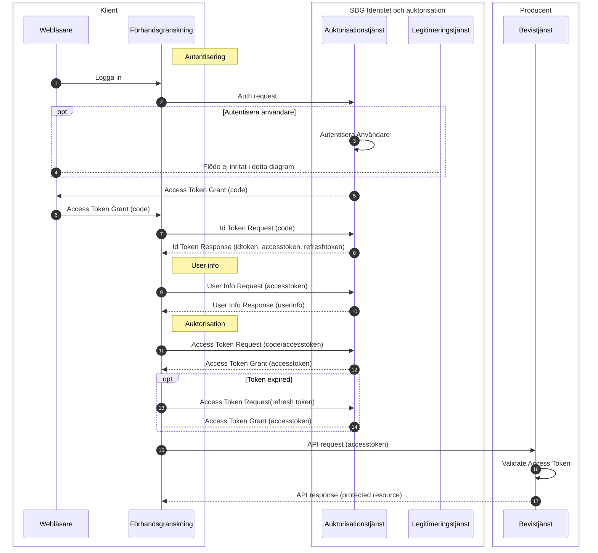

# SDG Auhtorizaion Sekvens diagram
## Bevishämtning
När en användare i ett svenskt onlineförfarande vill hämta ett digitalt bevis från ett annat eu medlemsland.
Det svenska online förfarandet begär ett åtkomstintyg för att kunna anropa den svenska vidareförmedlingstjänsten för 
att hämta ett bevis via OOTS.
### Sekvensdiagram
*TBD!

## Bevisförmedling
När en användare via ett utländskt onlineförfarande vill hämta ett digitalt bevis från Sverige.
Användaren blir omdirigerad till den svenska förhandsgranskningstjänsten som autentiserar användaren och begär ett 
åtkomstintyg för att anropa bevistjänsten som ska tillhandahålla beviset.
### Sekvensdiagram

