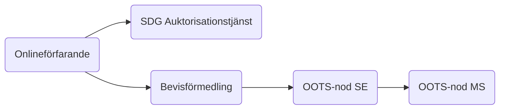
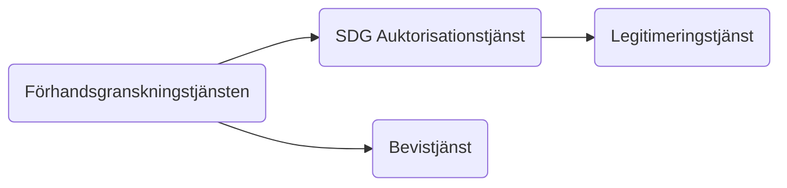
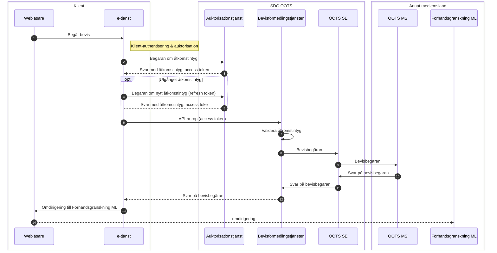
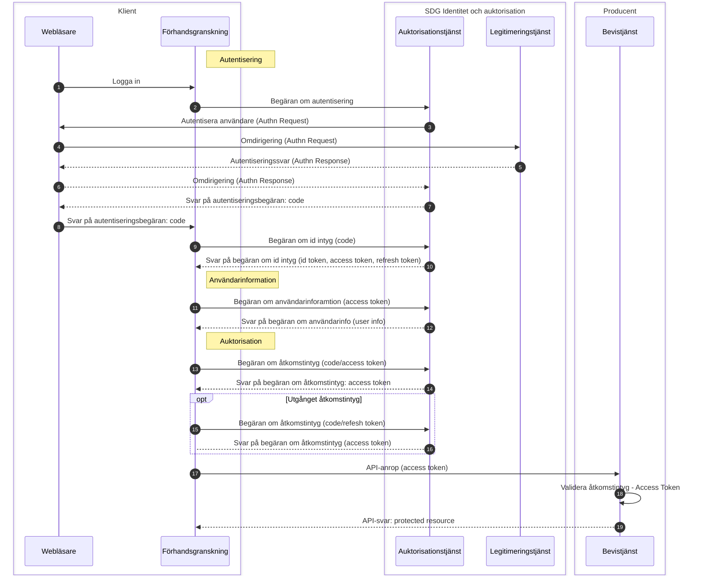

# Auktorisationsflöden - Once Only Technical System, SDG

## Auktorisationsflöden

* Bevishämtning, svenskt online-förarande hämtar bevis från annat medlemsland

* Bevisförmedling, utländskt online-förfarande hämtar bevis från Sverige

### Auktorisationsflöde vid bevishämtning

#### Beskrivning

När en användare i ett svenskt online-förfarande vill hämta ett digitalt bevis från ett annat medlemsland.
Ett svenskt online-förfarande begär ett åtkomstintyg för att kunna anropa den svenska bevisförmedlingstjänsten för 
att hämta ett bevis via OOTS.

#### Flödesbeskrivning

* Använderaren vill hämta ett bevis från annat medlemsland
* E-tjänsten skickar en signerad begäran om åtkomst till SDG Auktorisationstjänst
* Auktorisationstjänsten validerar begäran och kontrollerar att e-tjänsten tillhör en behörig myndighet
* Auktorisationstjänsten ställer ut ett åtkomstintyg till e-tjänsten
* E-tjänsten anropar Bevisförmedlingstjänsten och bifogar åtkomstintyget
* Bevisförmedlingstjänsten validerar att åtkomstintyget är signerat av betrodd auktorisationstjänst
* Bevisförmedlingstjänsten gör en bevisbegäran via OOTS SE

#### Detaljerat flöde

*Diagram 1: Sekvensdiagram över auktorisationsflödet vid bevishämtning*

#### Informationsobjekt vid bevishämtning

##### Åtkomstbegäran

Datamängd

* iss - id på klienten som skapar intyget
* sub - id på klienten som skapar intyget
* aud - url till auktorisationstjänsten
* iat - tidpunkt när intyget skapades
* exp - giltighetstid för intyget
* jti - unik identiferare för detta intyg
* Samt en signatur av intyget

Se specifikation för ytterligare och mer detaljerad beskrivning: https://docs.swedenconnect.se/technical-framework/sdg/sdg-oauth2-profile.html#client-authentication

##### Åtkomstintyg (Access token)

Datamängd
* iss - utgivaren av intyget, i detta fall auktorisationstjänsten
* exp - giltigthetstid för intyget  
* aud - mottagaren av intyget, i den resurstjänst som efterfrågas
* sub - identitet på resursägaren, i detta fall personnummer på inloggad användare
* client_id - identitet på klienten
* scope - omfattning av intygets användningsområde
* iat - utgivningstidpunkt för detta intyg
* jti - unik identfierare för detta intyg, genererat av klienten
*Samt en signatur av intyget

Se specifikation för ytterligare och mer detaljerad beskrivning:https://docs.swedenconnect.se/technical-framework/sdg/sdg-oauth2-profile.html#token-responses-and-validation

### Auktorisationsflöde vid bevisförmedling

#### Beskrivning

När en användare via ett utländskt onlineförfarande vill hämta ett digitalt bevis från Sverige.
Användaren blir omdirigerad till den svenska förhandsgranskningstjänsten som autentiserar användaren och begär ett åtkomstintyg för att anropa bevistjänsten som ska tillhandahålla beviset.

#### Flödesbeskrivning

* Använderaren vill hämta ett bevis från Sverige
* E-tjänsten i ett annat medlemsland skickar en bevisbegäran till Sverige
* Användaren blir omdirigierad till Sveriges förhandsgranskgning
* Förhandsgranskningstjänsten ber Auktorisationstjänsten om att identifiera användaren
* Auktorisationstjänsten använder Sveriges eIDAS-nod för att identifiera användaren
* Efter att användaren har legitimerat sig kan förhandsgranskningstjänsten hämta information om användaren
* Förhandsgranskningstjänsten ber sedan Auktorisationstjänsten om ett åtkomstintyg för att få hämta begärt bevis från en bevisproducent
* Auktorisationstjänsten ställer ut ett åtkomstintyg till förhandsgranskningstjänsten
* Förhandsgransningstjännsten bifogar åtkomstintyget i anropet till bevisproducenten
* Bevisproducenten validerar åtkomstintyget och svarar med begärt bevis

#### Detaljerat flöde

*Diagram 2: Sekvensdiagram över auktorisationsflödet vid bevisförmedling*

#### Informationsobjekt vid bevisförmedling

##### Autentiseringsbegäran (Authn Request)

Se specifikation för beskrivning:
https://docs.swedenconnect.se/technical-framework/latest/02_-_Deployment_Profile_for_the_Swedish_eID_Framework.html

##### Identitetsintyg (Authn response)

Datamängd
* sn (Surname) - efternamn
* givenName (Given name) - förnamn
* displayName (Display name) - visningsnamn
* personalIdentityNumber (National civic registration number) - nationell identitetsbeteckning 
*dateOfBirth (Date of birth) - födelsedatum

Se specifikation för ytterligare och mer detaljerad beskrivning: https://docs.swedenconnect.se/technical-framework/latest/04_-_Attribute_Specification_for_the_Swedish_eID_Framework.html

##### Idintyg (Id Token)
* iss - utgivare av intyget
* sub - identitet som intyget gäller, i detta fall ett
* aud - mottagare av intyget, i detta fall klienten
* exp - giltighetstid för intyget 
* auth_time	- tidpunkt när användaren authentiserades 
* nonce - värde generat av klienten, används för att motverka återspelningsattacker
* acr - vilken autentiseringsmetod som använts

Se specifikation för ytterligare och mer detaljerad beskrivning: https://www.oidc.se/specifications/swedish-oidc-profile.html#id-token-contents

##### Åtkomstbegäran

Datamängd
* iss - id på klienten som skapar intyget
* sub - id på klienten som skapar intyget
* aud - url till auktorisationstjänsten
* iat - tidpunkt när intyget skapades
* exp - giltighetstid för intyget
* jti - unik identiferare för detta intyg
*Samt en signatur av intyget

Se specifikation för ytterligare och mer detaljerad beskrivning: https://docs.swedenconnect.se/technical-framework/sdg/sdg-oauth2-profile.html#client-authentication

##### Åtkomstintyg (Access token)

Datamängd
* iss - utgivaren av intyget, i detta fall auktorisationstjänsten
* exp - giltigthetstid för intyget  
* aud - mottagaren av intyget, i den resurstjänst som efterfrågas
* sub - identitet på resursägaren, i detta fall personnummer på inloggad användare
* client_id - identitet på klienten
* scope - omfattning av intygets användningsområde
* iat - utgivningstidpunkt för detta intyg
* jti - unik identfierare för detta intyg, genererat av klienten
*Samt en signatur av intyget

Se specifikation för ytterligare och mer detaljerad beskrivning:https://docs.swedenconnect.se/technical-framework/sdg/sdg-oauth2-profile.html#token-responses-and-validation
